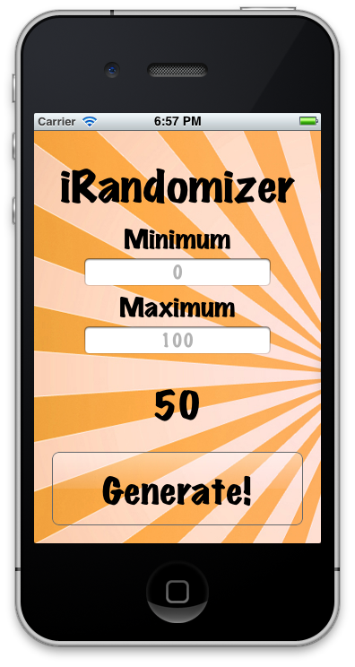
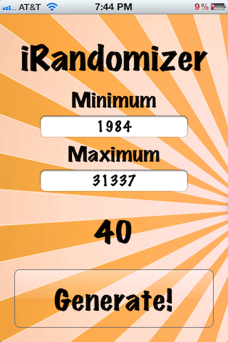
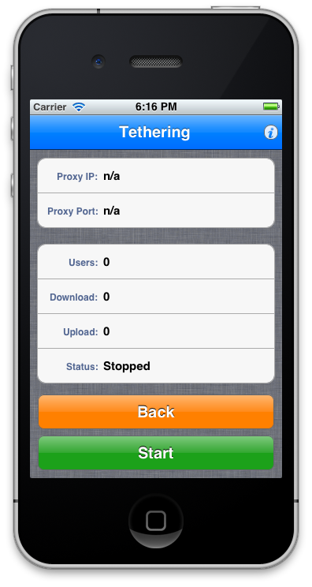

+++
title = "Hidden Tethering App"
description = "Sneaking a tethering app into the iPhone App Store (2012)"
date = 2022-03-24
categories = [
    "Developer"
]
tags = [
    "iOS",
    "dev"
]
image = "question-unsplash.jpg"
+++

> _In early 2012, I released a hidden tethering application into the App Store._
>
> _In less than 24 hours, the application ascended to the top of the charts, brought in over **$20k**, and made headlines._
>
> _Then it was pulled._
>
> _This is the story._

#### The idea

One beautifully crisp day in December of 2011, a headline popped up on a news site about an iPhone application that reached the top paid App Store position in a little under two hours - lightning fast.

Needless to say, I was intrigued.

Not only did this application reach the top position in record time, according to the article, there were only three others like it in the existence of the App Store; with all three having reached the top one or two position in a similar amount of time.

What surprised me most wasn’t that the application reached the top paid position in under two hours, it was the fact that only three applications had ever attempted such a feat.

If each of these apps could reach the top position in so little time, then why hadn’t anyone else attempted it?

The reason, as you might have guessed, is because it violates the Apple developer agreement.
All three of the applications contained the same feature: Tethering.

Tethering, for those who don't know, is a feature that enables you to share the network connection from your mobile device to your laptop or desktop computer. Tethering is barred from the iOS App Store. The reasons why aren't 100% unclear, but, in Apple’s own words, are due to “causing excessive or unduly burden on a carrier’s network” – in other words, carriers lose money.

Although Apple strictly forbids tethering functionality on the App Store, many carriers now include it in their unlimited plans and jailbroken users can easily find the feature for free.  Back in 2012, tethering allowed users to skirt carrier fees and bypass extra costs associated with the feature on a mobile plan, which could have added hundreds of dollars a year.

As someone usually does when they identify a niche in the market, I set out to learn all I could about tethering.

#### The execution

I started to gather as much information as I could about tethering and these previous tethering applications.

In total, I found that there had actually been 5 iPhone applications that contained tethering capabilities released publicly. Only two of those applications were sanctioned by Apple (short-lived), with the intent of being sold openly as tethering applications: NetShare and iTether. (iTether being the only fully-fledged application that also had a desktop application to help users connect.)

The remaining three applications that snuck in were a mix match of utility applications with varying degrees of functionality:

* Handy Light - a simple flashlight
* QuasiDisk - a file manager
* Payupsucker – a note taker

All of these applications utilized either a proxy, or in the case of iTether, a reverse SSH tunnel.  In researching, I found that there were actually many ways to tether a network connection.  In no particular order, you could:

* Utilize a SOCKS proxy
* Develop a mobile hotspot solution over Wi-Fi or Bluetooth
* Reverse SSH tunnel over USB

Any developer could create an application with tethering functionality. In fact, there were two open-source iPhone applications available at the time: "iPhone-SOCKS-proxy" and "Tabi".

Inspired by "iPhone-SOCKS-proxy", I put all of my other projects on hold and set out to create a tethering application. In two short days, I crafted a very basic SOCKS proxy tethering application that seemed to work in the simulator. I plugged in my iPhone to test the application and to my surprise it actually worked!

After that, I spent the next few days thinking about the ramifications of introducing an app like that publicly and decided to keep it to myself.

#### Friends and family

A few weeks later, the idea got brought up with a few friends, all of whom were very interested in using tethering functionality themselves. A consensus was reached that the functionality should be released into the App Store **secretly** so other friends and family could use it without having to share local builds.

Admittedly, there was some concern about an application with hidden functionality being released:

* For one, what would happen if the functionality were discovered?
* What impact would that have on me?
* Was it even possible to sneak hidden functionality into an app?
* What happens if the feature was caught during the review process?

It was also unclear what happened to the developers of the other applications:

* Were they barred from iOS development?
* Were they allowed to continue selling other applications in the App Store?
* Did they get sued?

After some debate and internal consideration, I decided that the concerns were valid, but the level of risk was tolerable. I didn’t think it would spread beyond friends and family, especially after I devised the application that would secretly carry the feature.

#### iRandomizer Numbers

Thus, my application "iRandomizer Numbers" was born.

iRandomizer Numbers cost a whopping **$4.99**. Quite a bit for a simple utility application that provided only one of the features that my application "iRandomizer" contained for free.

To be safe, the tethering feature was hidden behind a self-contained password in the application input, I obfuscated the tethering functionality in the code, and I only shared the secret with a few close friends and family. On top of that, the application had absolutely no substance.

> Another dreadful fart app in the world of “pull my finger”. It was genius.

Within a week, even with the same name, icon, and functionality as my free application "iRandomizer", iRandomizer Numbers was accepted into the App Store, proving that it was possible to sneak a feature past the scrutiny of the review team.

I began handing out promo codes that same day. All seemed right with the world.

#### Leak

About a week after the release, one of my friends leaked the feature onto a private forum. From there, the word spread like wildfire. I began receiving dozens of emails a day thanking me for releasing the app and asking me how to use it.

I was torn. I appreciated the feedback and support, but I didn’t want any negative repercussions. By supporting the application, I was afraid of the negative affects it might have on my professional reputation and other sales.

I might have removed the application from sale that week (and looking back on it I probably should have) if not for the amazingly positive feedback coming from many of the people who bought it. Many customers were AT&T or Verizon users who were grandfathered in to the unlimited data plan and didn’t want to lose it. Some were users who didn’t want to pay the monthly fee or jailbreak their phones, and others just wanted to be able to say they had an illicit app.

The support was overwhelming. Nearly everyone who messaged me wanted to see tethering apps allowed in the App Store.

#### Removed from sale

A little over a week after the initial leak, a reporter called asking for a statement. I admitted that the app contained the feature and explained that I planned to let it stay up until Apple removed it. The story released later that evening and application sales took off.

By 12pm Saturday afternoon, iRandomizer Numbers skyrocketed to the top #40 paid application spot. I remember nervously pacing and refreshing the App Store to see which position it held.  Slowly surpassing applications that I used every day, finally getting to the #2 Paid position in the App Store.

Elated by the app's success, but extremely nervous about the potential outcomes, my nerves subsided when, after **over 5,000 purchases in one day totaling over $20k**, my secret tethering app was officially removed by Apple.

#### Aftermath

The following Monday I received a phone call from a member of the App Store Review Team.

The employee expressed extreme displeasure about the application and my antics. I was told, in no uncertain terms, that I would be lucky to keep my developer license and that additional app reviews would be given increased scrutiny. In addition, I was given the reasons the application was pulled:

* Excessive bandwidth usage
* Hidden features

Fortunately, I was lucky enough to retain my developer license and would recommend not releasing applications with hidden features.

#### What happened afterwards

I didn't find out until later, but at the same time that my hidden tethering app "iRandomizer Numbers" was removed from sale, my other legitimate random number generator application "iRandomizer" was also pulled.

I'm still not clear on why both were pulled, but it's likely that because the names were so similar and shared a similar icon, no distinction was made.

Upon appealing, and through a lengthy review, "iRandomizer" was allowed back in to the App Store.

And that’s the story of my hidden tethering app.
